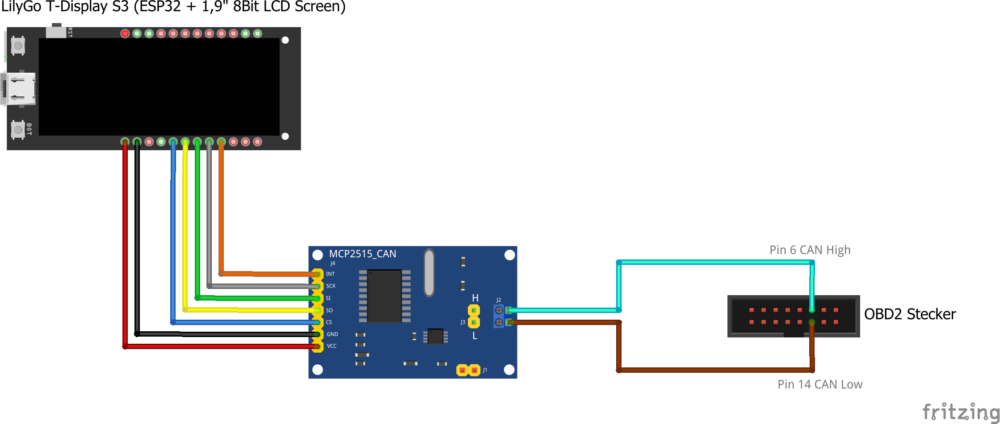

# Topolino Info Display

## Hardware:
LilyGo T-Display S3
- ESP32
- 1,9" 8Bit LCD Screen

MCP 2515 Can Bus module

### Wireing:

## Software:
Build as PlatformIO project in Visual Studio Code.

### Libraries:
- [TFT_sSPI](https://doc-tft-espi.readthedocs.io/)
- [Arduino MCP2515](https://github.com/autowp/arduino-mcp2515/)
