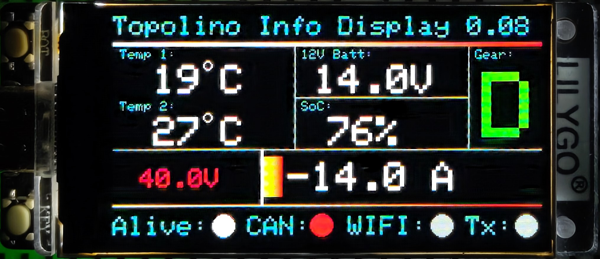

# Topolino Info Display
Shows some details of the electronic system of the car, send it to a central (houseautomation-) system for further processing and status information.

## Drive screen

## Trip information:

## Car compatibility:
- Fiat Topolino (Testcar: MY 2025)
- Opel Rocks-e
- Citroen Ami

---
# Hardware (Development enviroment):
- [LilyGo T-Display S3](https://lilygo.cc/products/t-display-s3?variant=42284559827125) (ESP32 + 1,9" 8Bit LCD Screen)
- [MCP 2515 Can Bus module](https://www.az-delivery.de/products/mcp2515-can-bus-modul-1)
- 3D printed OBD2 plug

## Wireing:

|  | T-Display S3 | MCP2515_CAN |
|-|-|-|
| Power 5V | 5V | VCC |
| Ground | GND | GND |
| Chip select | PIN 10 | CS|
| SPI MISO | PIN 13 | SO |
| SPI MOSI | PIN 11 | SI |
| Serial clock | PIN 12 | SCK |
| Interrupt | PIN 3 | INT |

# Software:
Build as **PlatformIO** project in **Visual Studio Code**.
Data transmission designed forseen to submit values to **ioBroker** via **SimpleAPI**.

## Libraries:
Standard:
- Arduino
- WIFI
- HTTPCLient
- SPI

Additional:
- [TFT_sSPI](https://doc-tft-espi.readthedocs.io/) - ⚠ Take care to select the right display un User_Setup_Select.h
- [ACAN2515](https://github.com/pierremolinaro/acan2515/tree/master)

## Configuration
Rename ./config/config_example.h to config.h and fill the values

## ioBroker states
| iobroker object | value|
|--|--|
| 0_userdata.0.topolino.12VBatt | Voltage of the 12V Battery system |
| 0_userdata.0.topolino.BattA | Drive battery currently consumed ampers |
| 0_userdata.0.topolino.BattTemp1 | Drive battery temperature sensor 1 |
| 0_userdata.0.topolino.BattTemp2 | Drive battery temperature sensor 2 |
| 0_userdata.0.topolino.BattV | Drive battery coltage |
| 0_userdata.0.topolino.Handbreak | Manual handbreaks set/ not set |
| 0_userdata.0.topolino.ODB | Total driven kilometers |
| 0_userdata.0.topolino.OnBoardChargerRemaining | Remaining minutes until charging is finished |
| 0_userdata.0.topolino.Ready | drive ready state |
| 0_userdata.0.topolino.RemainingKM | propossed kilometers left in drive battery |
| 0_userdata.0.topolino.SoC | State of Charge - drive battery in percent |
| 0_userdata.0.topolino.gera | selected gear |
| 0_userdata.0.topolino.speed | current speed |

---
# ⚠ Warning / Hint
**This is NOT a "ready to use" solution!**
You have compile it by your own. Most likley you have to adapt it to your specific eviroment. 