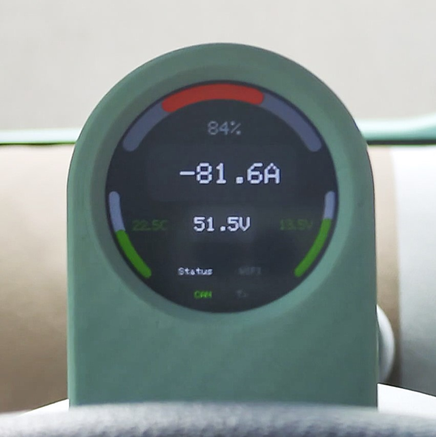
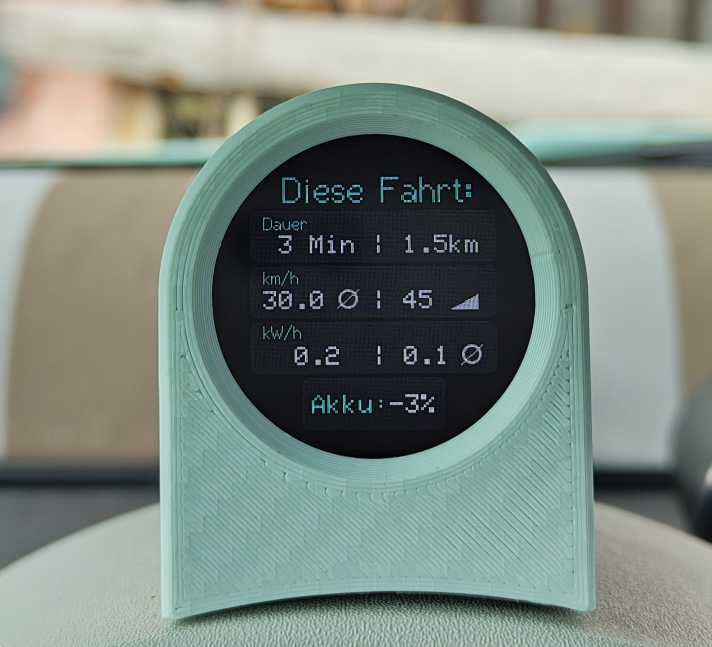
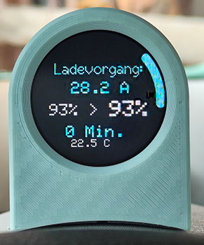
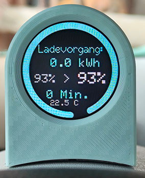

# Topolino Info Display
Shows some details of the electronic system of the car, send it to a central (houseautomation-) system for further processing and status information. Additional a reversing light is controlled via a Bluetooht relaisbox.

## Drive screen

Shown information:
- Currently used power: multi-color bar + value (kW)
- Drive battery temperature: multi-color bar + value (°C)
- Drive battery voltage
- Drive battery stae pof charge (SoC %)
- 12V Battery voltage (shown before start driving)
- Average consumption (kWh) for the current trip
- Indicators for status, WIFI connection, Bluetooth, data transmition, CAN-Bus data communication

## Trip information

Shown information:
- Trip duration in minutes
- Trip distance in km
- Maximum speed reached
- Average speed of the trip
- Consumed energy in kwh
- Consumed energy in percent (SoC)
- Average consumption (kwh / 100km)

## Charging information

Shown information during charging:
- Charging power in ampere
- SoC start value for this charge
- Current SoC value
- Minutes since charge started (duration)
- Drive battery temperature

Shown information after charge ended:
- Power charged (kwh)
- Start Soc + end SoC of the charge
- Drive battery temperature
- Duration opf the charge (Minutes)

## Car compatibility:
- Fiat Topolino (Testcar: MY 2025)
- Opel Rocks-e
- Citroen Ami

---
# Hardware:
## Version 1 (inital Development enviroment / no longer used)
- [LilyGo T-Display S3](https://lilygo.cc/products/t-display-s3?variant=42284559827125) (ESP32 + 1,9" 8Bit LCD Screen)
- [MCP 2515 Can Bus module](https://www.az-delivery.de/products/mcp2515-can-bus-modul-1)
- 3D printed OBD2 plug

## Version 2 (current)
- [NodeMCU ESP32 Development Board 30 PIN](https://amzn.eu/d/eRXytsF)
- [1,28" TFT round GC9A01](https://amzn.eu/d/7S9U4s6)
- [MCP 2515 Can Bus module](https://www.az-delivery.de/products/mcp2515-can-bus-modul-1)
- 3D printed OBD2 plug
- [3D printed housing](https://makerworld.com/en/models/1659904-topolino-info-display-case#profileId-1755776)

### Wireing (Version 2):

---
# Software:
Build as **PlatformIO** project in **Visual Studio Code**.
Data transmission designed forseen to submit values to **ioBroker** via **SimpleAPI**.

## Libraries:
Standard:
- Arduino
- WIFI
- HTTPCLient
- SPI
- ArduinoOTA

Additional:
- [TFT_sSPI](https://github.com/Bodmer/TFT_eSPI)
- [ACAN2515](https://github.com/pierremolinaro/acan2515/)
- [urlencode](https://github.com/plageoj/urlencode)
- [TelnetStream](https://github.com/JAndrassy/TelnetStream)

## Configuration
Rename ./config/config_example.h to config.h and fill the values

## ioBroker integration
Data Send to "SimpleAPI" adapter via HTTP REST calls.

### States
| iobroker object | value|
|--|--|
| 0_userdata.0.topolino.12VBatt | Voltage of the 12V Battery system |
| 0_userdata.0.topolino.BattA | Drive battery currently consumed ampers |
| 0_userdata.0.topolino.BattTemp1 | Drive battery temperature sensor 1 |
| 0_userdata.0.topolino.BattTemp2 | Drive battery temperature sensor 2 |
| 0_userdata.0.topolino.BattV | Drive battery coltage |
| 0_userdata.0.topolino.Handbreak | Manual handbreaks set/ not set |
| 0_userdata.0.topolino.ODB | Total driven kilometers |
| 0_userdata.0.topolino.OnBoardChargerRemaining | Remaining minutes until charging is finished |
| 0_userdata.0.topolino.Ready | drive ready state |
| 0_userdata.0.topolino.RemainingKM | propossed kilometers left in drive battery |
| 0_userdata.0.topolino.SoC | State of Charge - drive battery in percent |
| 0_userdata.0.topolino.gear | selected gear |
| 0_userdata.0.topolino.speed | current speed |

Additionally the Trip data is reported to IOBroker.

---
# ⚠ Warning / Hint
**This is NOT a "ready to use" solution!**
You have to adapt it to your specific eviroment. You have to asamble the hardware by your own. You have compile it by your own. There is no support or guarantee! Take your reponsibility!

---
# Thank You
Thanky you to the project [AMI-Display](https://github.com/flrahe/AMI-Display) which inspired me to start this project and provided the information about the CAN-Messages of this "car".
